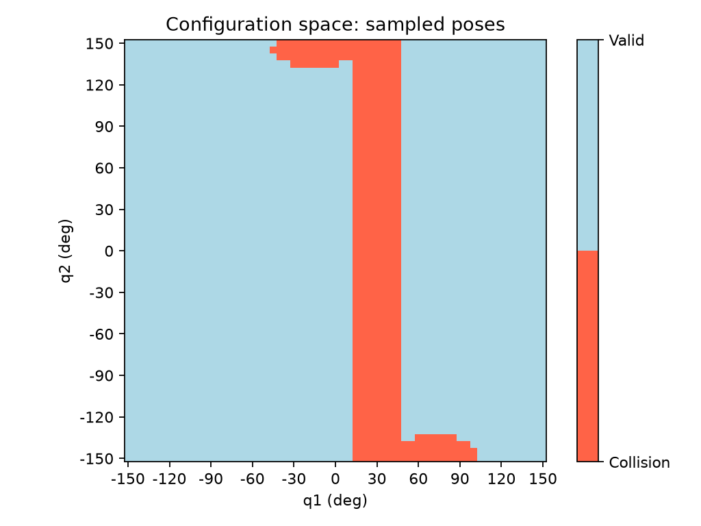

# 实验 03：姿态有效性检查与构型空间地图

> 日期：2026-09-22。按实验模板整理；学习者在 AI 提示和示例辅助下完成实现、运行并提供图像，助手在编写报告时复跑当前代码并归档数据。未把尚未实现的路径检查或规划记为完成。

## 问题与预测

- **这次只验证什么？** 将两杆碰撞检测封装为姿态有效性检查，加入关节限位；扫描关节角并绘制构型空间中的碰撞采样点。
- **运行前的预测：** 如果第一杆已经碰撞，改变第二关节角不能使整体安全。由此预期，在某些固定 q1 下，全部 q2 都无效，图中应出现竖直碰撞带。
- **原因：** 第一杆位置只由 q1 决定；整体碰撞条件是两杆碰撞结果的逻辑或。
- 未记录对碰撞采样点数量或全部边界形状的事前预测，不补造预测数据。

## 方法与复现

### 日期、阶段、代码提交号

- 日期：2026-09-22。
- 阶段：第 2 周“全连杆碰撞与构型空间”；开始讨论第 3 周的直线连接检查，尚未实现该部分。
- HEAD：`aa4672241fc8abde0a82bbca815e0004fdae915e`。
- 版本限制：本次运行来自本地工作区，`is_pose_valid.py`、`simple_check.py` 和 `cspace_span.py` 尚未跟踪，此提交号不包含完整实验代码。正式归档时需补充包含这些文件的提交号。

### 运行命令、依赖版本

在项目根目录执行：

```powershell
.\.venv\Scripts\python.exe -m armlab.is_pose_valid
.\.venv\Scripts\python.exe -m examples.cspace_span
```

第一条运行 9 个断言案例；第二条打印扫描统计并显示地图。注意实际文件名为 `cspace_span.py`。

报告编写时，助手以 Agg 无窗口后端通过 `runpy.run_module(..., run_name="__main__")` 复跑这两个入口，并保存图、数组、指标和输出日志。原扫描脚本只显示图片，不会自动保存这些文件。

- Python：3.12.14。
- NumPy：2.5.3。
- Matplotlib：3.11.2。

### 模型、场景、参数、种子

- 平面 2R，杆长 0.30 m 和 0.25 m；基座为 (0, 0)，零位沿 +X。
- q1 相对世界 +X，q2 相对第一杆；函数输入为 rad，扫描列表和图轴使用度。
- 两关节限位均为 [-150°, 150°]，允许边界，不做跨边界绕回。
- 扫描场景：单个静态圆，圆心 (0.15, 0.08) m，半径 0.04 m；杆半径 0.01 m。
- 碰撞函数保留 `1e-12 m` 数值容差，未增加独立的物理安全裕量参数。
- 初始扫描：每关节取 [-150, -75, 0, 75, 150]，共 25 个姿态。
- 加密扫描：`np.arange(-150, 151, 5)`，每关节 61 个角度，共 3721 个姿态。
- 随机种子：不适用，本次是确定性网格扫描。

### 对照方法与指标单位

- `is_pose_valid`：先检查限位，再计算基座 O、肘部 E、末端 tip；调用碰撞函数检查 O→E 和 E→tip，返回 `not (collision_1 or collision_2)`。
- 9 个案例覆盖：两杆安全、仅第一杆碰撞、仅第二杆碰撞、两个关节分别超出正负限位、两组正负边界组合。
- 限位案例使用远处圆心 (1, 1) m，排除障碍干扰。
- 二维数组采用 `valid_grid[j, i]`，行 j 对应 q2，列 i 对应 q1。
- `imshow` 使用 `origin="lower"`；False 为红色，True 为浅蓝色。下标刻度标注为角度，每 30° 显示标签。
- 指标为通过案例数、采样姿态总数、有效/碰撞姿态数，单位均为个；不是路径规划成功率或连续空间面积比例。

## 结果

### 实际数据与图表位置

| 检查 | 实际结果 | 证据 |
| --- | --- | --- |
| 姿态有效性验收 | 9/9 通过 | 学习者提供运行输出；助手本次复跑一致 |
| 初始 5×5 扫描 | 23 个有效，2 个碰撞 | 本会话此前实际运行 |
| 当前 61×61 扫描 | 3215 个有效，506 个碰撞，总计 3721 | 助手本次复跑当前实现 |
| 坐标方向与颜色 | 行为 q2，列为 q1，负 q2 位于下方 | 代码核对及学习者提供的图像 |

初始扫描的两个碰撞点为 (q1=0°, q2=150°) 和 (q1=75°, q2=-150°)，分别位于数组 [4, 2] 和 [0, 3]。

归档位置：

- [加密扫描地图](../assets/collision/cspace-scan-2026-09-22/cspace_grid.png)。
- [验收与扫描输出](../assets/collision/cspace-scan-2026-09-22/verification.txt)。
- [依赖版本与统计](../assets/collision/cspace-scan-2026-09-22/metrics.json)。
- [布尔矩阵](../assets/collision/cspace-scan-2026-09-22/valid_grid.npy)、[采样角度](../assets/collision/cspace-scan-2026-09-22/angles_deg.npy)，可用 `np.load` 读取。
- 学习者提供的原图位于本机 `E:/下载目录/Figure_1.png`；上面的项目内图片由当前脚本重新生成。



### 和预测一致／不一致的地方

- 提供的图像显示贯穿 q2 方向的红色竖带，符合“第一杆碰撞无法通过改变 q2 消除”的预测。
- 上下边缘伸出的红色区域与第二杆折回造成碰撞的几何解释一致；图中只保存整体有效性，尚未逐点另存碰撞杆编号，不能单凭颜色断定每个点的具体碰撞部位。
- 没有预先预测碰撞点数量，因此不将 506 这个结果表述为验证了事前数量预测。

### 失败案例及原因证据

- 9 个验收案例中的碰撞与超限结果是预期拒绝，不是程序异常；本次复跑没有断言失败。
- 75° 的粗扫描只得到两个碰撞点，难以显示障碍形状；5° 扫描显示更多碰撞结构。两种分辨率采样数量不同，不能仅凭碰撞点数量增加断言算法更准确。
- 红色边界呈阶梯形，与网格采样和格子显示有关，不代表真实连续边界形状。
- 所有格子只代表采样姿态的结果，浅蓝格不能证明格子内部的全部角度组合都安全。

## 修正与理解

### 我犯了什么错，如何定位？

- 最初封装时按度数检查 ±150 并在函数内转换，和约定的弧度输入接口不一致。经审阅后统一为弧度输入，将限位转换为弧度。
- 最初在函数内部重新给圆心、半径和杆半径赋固定值，覆盖调用者参数；经审阅删除，保留传入场景。
- 最初只计算合并碰撞结果，没有返回姿态有效性；补充 `return not collision`。
- 扫描二维存储及绘图采用助手给出的示例，运行核对两个已知碰撞点对应的行列，确认没有转置。

### 修改后如何验证？

- 学习者运行 9 个案例并提供全部通过的终端输出；助手编写本报告时复跑一致。
- 初始扫描核对 25 个组合、两个 False 的位置以及图轴标签。
- 加密后学习者提供地图；本次进一步保存 61×61 矩阵和实际计数，使报告有可追溯数据。
- 本次报告整理没有修改运动学、碰撞、姿态检查或扫描算法。

### 本次能解释的知识点

- 第一杆碰撞时，改变 q2 不能使整体安全，因为第一杆不受 q2 影响。
- 起点、终点有效并不保证连接过程安全，中间姿态可能经过构型空间障碍。

本次已在提示下使用的知识包括弧度接口、布尔组合、双层循环、二维数组下标、构型空间绘图。未仅凭示例运行通过就认定已能独立推导或解释全部实现。

### 尚未理解的问题与下一步

- 个人仍有疑问的内容：我有一个问题，我代码里的cspace是按照5的梯度绘制的，但这样在当前采样分辨率下没有检测到碰撞，不代表连续运动中没有问题
- 解决方案：进行关节角插值
- 第 2 周主要实现已具备；仍需补充安全裕量的个人解释，并区分它与数值容差。
- 下一步生成两个关节姿态之间的插值：`q(s)=(1-s)*q_start+s*q_goal`。先以 (0°, 0°) 到 (60°, 0°) 为例，用 11 个比例生成中间姿态，再逐个调用有效性检查。
- 上述插值与通用运动连接检查尚未实现、未验证。需要研究采样步长的影响；全部采样通过不构成连续安全证明。
- 之后进入第 3 周的 A*，检查节点及连接边；目前尚未实现自动寻找绕行路径。

### 使用的参考资料与 AI 帮助范围

- 本项目的 [实验模板](experiment-template.md)、[路线图](roadmap.md)、[设计边界](project-scope.md) 及当前代码。
- 学习者：在提示下完成修改、运行验收、生成图像并回答几何概念问题。
- AI：审阅接口问题，提供 9 个验收案例、二维存储和绘图示例、加密采样建议，解释结果，复跑并归档实验数据，按模板整理报告。

